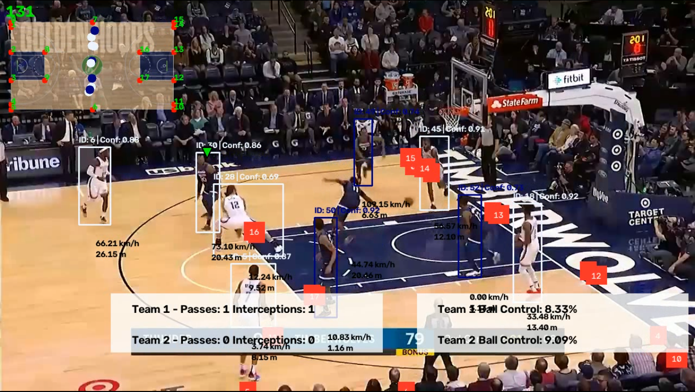

# 🏀 HoopVision

### End-to-End Basketball Computer Vision & Tactical Analytics

HoopVision is an end-to-end computer vision pipeline for analyzing basketball game footage. It combines object detection, multi-object tracking, team assignment, court keypoint detection, homography-based tactical mapping, ball possession analysis, pass and interception detection, and player movement analytics.

The system transforms raw basketball video into an enriched tactical video containing player identities, detection confidence, ball tracking, team information, player speed and distance, ball possession, passes, interceptions, and a top-down tactical court view.

---

## 🎥 Output Preview

<!-- OUTPUT IMAGE HERE -->

<p align="center">
  
</p>

<p align="center">
  <i>Example output generated by HoopVision.</i>
</p>

---

## ✨ Features

### 🎯 Player Detection

- Detects basketball players using YOLO.
- Generates bounding boxes around detected players.
- Displays player tracking IDs.
- Displays YOLO detection confidence scores.

### 🏃 Player Tracking

- Tracks players across video frames.
- Uses ByteTrack for multi-object tracking.
- Maintains consistent player identities throughout the video.

### 🏀 Ball Detection & Tracking

- Detects the basketball.
- Tracks the ball across frames.
- Handles missing detections through tracking and interpolation.

### 👕 Team Assignment

- Assigns detected players to their respective teams.
- Uses player appearance information for team classification.

### 🏟️ Court Keypoint Detection

- Detects important basketball court landmarks.
- Uses court keypoints to establish the geometric relationship between the camera view and the basketball court.

### 🗺️ Tactical View

- Converts player positions from image coordinates to a top-down tactical representation.
- Uses homography transformation based on detected court keypoints.

### 🎯 Ball Possession

- Determines which player currently has possession of the basketball.
- Visualizes the player currently associated with the ball.

### 🔄 Pass & Interception Detection

- Detects passing events.
- Identifies potential interceptions.
- Uses player identity, team assignment, and ball possession information.

### 📏 Speed & Distance Analysis

- Estimates player movement distance.
- Calculates player speed using the tactical court representation.

### 📊 Video Analytics Overlay

Combines the different computer vision components into a single annotated output video.

---

# 🧠 System Pipeline

```text
                    Input Basketball Video
                              │
                              ▼
                  ┌──────────────────────┐
                  │   Player Detection   │
                  │        YOLO          │
                  └──────────┬───────────┘
                             │
                             ▼
                    Player Tracking
                      ByteTrack
                             │
                             ▼
                  ┌──────────────────────┐
                  │   Ball Detection &   │
                  │      Tracking        │
                  └──────────┬───────────┘
                             │
                             ▼
                 Court Keypoint Detection
                             │
                             ▼
                      Team Assignment
                             │
                             ▼
                     Ball Possession
                             │
                             ▼
                Pass / Interception Detection
                             │
                             ▼
                  Homography Transformation
                             │
                             ▼
                      Tactical View
                             │
                             ▼
                Speed & Distance Calculation
                             │
                             ▼
                  Final Annotated Video
```

---

# 🛠️ Tech Stack

| Component | Technology |
|---|---|
| Programming Language | Python |
| Object Detection | Ultralytics YOLO |
| Multi-Object Tracking | ByteTrack |
| Computer Vision | OpenCV |
| Detection & Tracking Utilities | Supervision |
| Deep Learning | PyTorch |
| Numerical Computing | NumPy |
| Data Processing | Pandas |

---

# 📂 Project Structure

```text
HoopVision/
│
├── ball_aquisition/
│   └── ...
│
├── configs/
│   └── ...
│
├── court_keypoint_detector/
│   └── ...
│
├── drawers/
│   └── ...
│
├── images/
│   └── hoopvision_output.jpg
│
├── pass_and_interception_detector/
│   └── ...
│
├── speed_and_distance_calculator/
│   └── ...
│
├── tactical_view_converter/
│   └── ...
│
├── team_assigner/
│   └── ...
│
├── trackers/
│   └── ...
│
├── training_notebooks/
│   └── ...
│
├── utils/
│   └── ...
│
├── main.py
├── requirements.txt
├── .gitignore
└── README.md
```

---

# 🚀 Installation

## 1. Clone the Repository

```bash
git clone https://github.com/Perceptron04/HoopVision.git
cd HoopVision
```

---

## 2. Create a Virtual Environment

### Windows

```powershell
python -m venv .venv
```

Activate the environment:

```powershell
.venv\Scripts\activate
```

### Linux / macOS

```bash
python3 -m venv .venv
source .venv/bin/activate
```

---

## 3. Install Dependencies

```bash
pip install -r requirements.txt
```

---

# 🤖 Pretrained Models

The pretrained model weights are hosted separately on Hugging Face because the model files are too large to store directly in this GitHub repository.

### Hugging Face Model Repository

**HoopVision Models:**

https://huggingface.co/Tokyo00412/hoopvision-models

The repository contains the following pretrained weights:

```text
player_detection.pt
ball_detection.pt
court_keypoint_detection.pt
```

Download all three model files and place them inside a `models/` directory:

```text
HoopVision/
│
├── models/
│   ├── player_detection.pt
│   ├── ball_detection.pt
│   └── court_keypoint_detection.pt
│
├── main.py
└── ...
```

> The model weights are intentionally excluded from this GitHub repository because of their large file sizes.

---

# ▶️ Running HoopVision

Place your basketball video inside:

```text
input_videos/
```

For example:

```text
input_videos/
└── game.mp4
```

Then run:

```powershell
python main.py input_videos/game.mp4 --output_video output_videos/game_result.avi
```

The processed video will be saved to:

```text
output_videos/game_result.avi
```

---

# ⚙️ Command-Line Usage

### Basic usage

```powershell
python main.py input_videos/game.mp4
```

### Specify an output video

```powershell
python main.py input_videos/game.mp4 --output_video output_videos/result.avi
```

### Specify a stub path

```powershell
python main.py input_videos/game.mp4 --stub_path stubs
```

---

# 💾 Stub-Based Processing

HoopVision supports cached detection results through stub files.

Depending on the pipeline configuration, previously calculated results can be reused instead of running the corresponding detection or tracking models again.

This can be useful when:

- Testing different visualization methods.
- Debugging downstream components.
- Re-running analytics on the same video.
- Developing new features without repeatedly running expensive inference.

---

# 📊 Output Analytics

The final annotated video can contain several layers of basketball analytics.

## Player Analytics

- Player bounding boxes
- Player tracking IDs
- YOLO confidence scores
- Team assignment
- Player speed
- Distance travelled

## Ball Analytics

- Ball detection
- Ball tracking
- Ball possession

## Game Events

- Pass detection
- Interception detection
- Team ball control

## Tactical Analytics

- Court keypoints
- Top-down tactical court representation
- Player positions mapped onto the court

---

# 🏗️ Core Components

## 1. Player Tracker

The player tracking pipeline follows:

```text
YOLO Detection
      ↓
Player Filtering
      ↓
ByteTrack
      ↓
Persistent Player IDs
```

The tracker stores the player bounding box, tracking ID, and detection confidence.

---

## 2. Ball Tracker

The ball tracking pipeline follows:

```text
Ball Detection
      ↓
Ball Tracking
      ↓
Detection Filtering
      ↓
Position Interpolation
```

---

## 3. Team Assigner

The team assignment component uses player appearance information to assign detected players to their respective teams.

This allows later stages of the pipeline to distinguish between the two teams during possession and event analysis.

---

## 4. Court Keypoint Detector

The court keypoint detector identifies predefined landmarks on the basketball court.

These landmarks are used to estimate the geometric transformation between:

```text
Camera / Broadcast View
          ↓
     Court Keypoints
          ↓
       Homography
          ↓
    Tactical Court View
```

---

## 5. Tactical View Converter

The tactical view converter maps player positions from the original video frame into a top-down representation of the basketball court.

This provides a normalized spatial representation that can be used for movement and tactical analysis.

---

## 6. Ball Acquisition Detector

The ball acquisition component determines which tracked player is currently associated with ball possession.

This information is later used by the event detection modules.

---

## 7. Pass & Interception Detector

The pass and interception detector uses:

- Player tracking
- Team assignment
- Ball possession
- Temporal information

to identify passing and interception events.

---

## 8. Speed & Distance Calculator

The speed and distance calculator uses player positions in the tactical coordinate system to estimate:

- Distance travelled
- Player movement speed

Using the tactical representation makes the measurements more meaningful than directly measuring distances in raw image pixels.

---

# 🚧 Current Limitations

The current system is a research and development project and has several limitations:

- Detection performance depends on the quality of the input footage.
- Severe player occlusion can affect tracking.
- Ball detection can be difficult during fast motion or heavy occlusion.
- Camera angles significantly affect court keypoint detection.
- Tactical mapping depends on successful court keypoint detection.
- Speed and distance estimates depend on the quality of the homography transformation.
- Processing performance depends on available hardware.

---

# 🔮 Future Improvements

Planned or potential improvements include:

- [ ] Improved player re-identification
- [ ] More robust ball tracking under occlusion
- [ ] Shot detection
- [ ] Shot location analysis
- [ ] Rebound detection
- [ ] Assist detection
- [ ] Defensive coverage analysis
- [ ] Player heatmaps
- [ ] Team formation analysis
- [ ] Advanced possession analytics
- [ ] Real-time inference
- [ ] Web-based analytics dashboard
- [ ] Automated game statistics
- [ ] Model optimization for faster inference
- [ ] Support for additional basketball camera angles

---

# 📚 Resources

### Source Code

https://github.com/Perceptron04/HoopVision

### Pretrained Models

https://huggingface.co/Tokyo00412/hoopvision-models

---

# 👨‍💻 Author

**Perceptron04**

GitHub:

https://github.com/Perceptron04

---

# ⭐ Support

If you find this project useful or interesting, consider giving the repository a ⭐ on GitHub.

Contributions, suggestions, and improvements are welcome.
